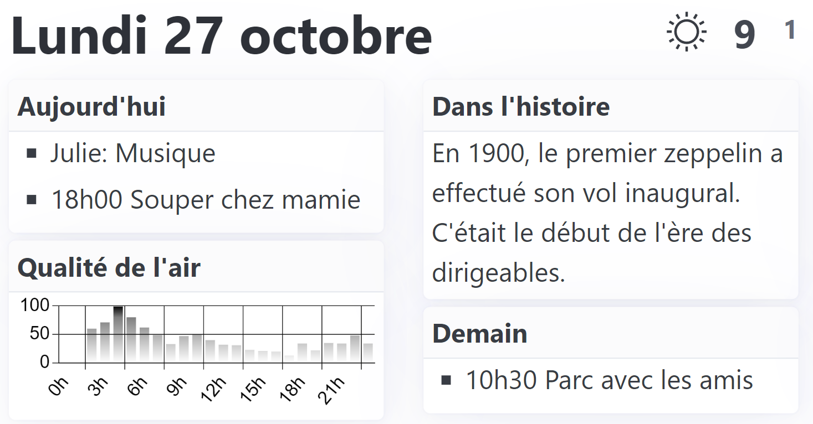

# Kidscreen

Displays upcoming events, weather and air quality forecasts, and other useful daily information on an e-ink screen.

## Hardware

I used a [Soldered Inkplate 5 Gen 2](https://soldered.com/product/inkplate-5-gen2/) but could probably be adapted to work 
with any e-ink screen that has a Wi-Fi antenna and runs Arduino.

## Software

There's two parts to the software: a small Arduino program to update the screen, and a command-line Linux program to
fetch and assemble the daily information. The Linux program fetches data from a few places: Google Calendar, Open-Meteo,
ChatGPT, etc. It then assembles this data into a few cards on a web page. Next, it runs a headless Chrome browser to
capture a screenshot of the page. Finally, it saves the screenshot in a location where it can be served by a web server.
The Arduino program wakes up once a day, connects to Wi-Fi, grabs the screenshot from the web server, updates it's
display, and goes back to sleep.